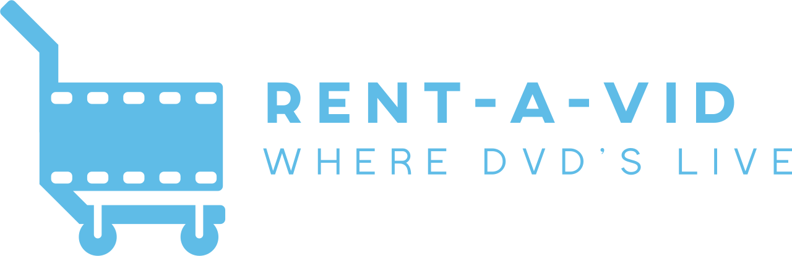

# Rent-A-Vid



Rent-A-Vid is the parent repository for a fictional DVD rental company. It contains the necessary components and services to run the Rent-A-Vid platform. This is a dummy video rental project to showcase a full end-to-end application generated with the assistance of generative AI

## Table of Contents

- [Rent-A-Vid](#rent-a-vid)
  - [Table of Contents](#table-of-contents)
  - [Prerequisites](#prerequisites)
  - [Installation](#installation)
  - [Usage](#usage)
  - [Contributing](#contributing)
  - [License](#license)

## Prerequisites

Before installing and running the project, make sure you have the following dependencies installed:

- Docker
- npm
- Python 3.11


## Installation

To set up the project locally, follow these steps:

1. Clone the repository:
   ```
   git clone https://github.com/ranson21/rentavid.git
   ```

2. Navigate to the project directory:
   ```
   cd rentavid
   ```

3. Initialize and update the submodules:
   ```
   git submodule update --init --recursive
   ```

4. Build the dependencies:
   - For the web app:
     ```
     cd apps/web
     npm run docker:build
     ```
   - For the API service:
     ```
     cd services/api
     make build
     ```

Please note that `apps/web` and `services/api` are submodules that need to be cloned separately. The `git submodule` commands ensure that these submodules are properly initialized and updated.

## Usage

To run the environment locally using Docker Compose, change to the local environment directory and use the following command:

```
cd environments/local
docker-compose up
```

This will start all the necessary containers and services.

## Contributing

Contributions are welcome! If you'd like to contribute to this project, please follow these steps:

1. Fork the repository
2. Create a new branch (`git checkout -b feature/your-feature`)
3. Commit your changes (`git commit -m 'Add your feature'`)
4. Push to the branch (`git push origin feature/your-feature`)
5. Open a pull request

## License

This project is licensed under the [MIT License](LICENSE).

---

Created by [Abigail Ranson](https://github.com/ranson21) with ❤️